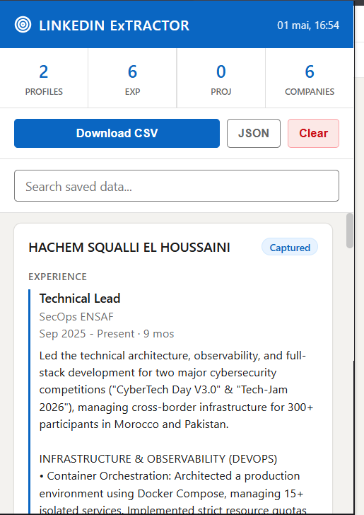
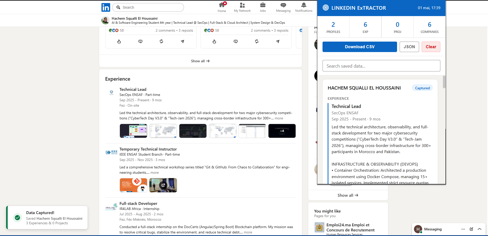

#  LinkedIn Experience ExTRACTOR | Local-First Experience Extractor

Stop copy-pasting LinkedIn profiles manually. Extract nested experience, projects, and metadata into clean CSVs or json automatically **100% privately, securely, and for free.**

 

## 📖 The Story (Why I built this)
I built this tool out of pure necessity. As a student, I was desperately looking for a strict two-month internship. I realized the only way to find opportunities was to analyze the career paths of alumni and build a database of companies and recruiters. 

But there was a huge problem: every scraping tool out there was either hidden behind an expensive paywall, sent my data to a sketchy third-party database, or used aggressive bot tactics that risked getting my LinkedIn account banned. 

I just needed something that worked while I naturally browsed. So, I built this. It started as a quick "vibe-coded" script to solve my internship hunt, but it evolved into a highly robust, privacy-first extraction tool.

## ✨ Why this is different (The "No-Ban" Guarantee)

The biggest selling point of this extension is what it **doesn't** have: a backend. 

* 🛡️ **100% Privacy (Serverless):** This extension runs entirely locally in your browser using `chrome.storage.local`. Your scraped leads and data are never sent to a random database or cloud server. You own your data.
* 🚫 **Zero Ban Risk:** Unlike API scrapers that trigger LinkedIn's bot detection, this tool extracts data straight from the DOM (what you actually see on your screen) while you browse normally. It behaves exactly like a human user, keeping you safe from ToS violations.
* 💸 **Completely Free:** No API keys, no subscriptions, no premium tiers. 

## ⚙️ How it Works (Under the Hood)
LinkedIn is a heavy Single Page Application (SPA) that uses heavily obfuscated CSS classes and aggressive **Lazy Loading** (sections don't exist in the code until you look at them). 

To solve this, the extension uses:
1. **Automated Smooth Scrolling:** When you land on a profile, the script seamlessly scrolls down and back up to force LinkedIn to render the "Experience" and "Project" React components.
2. **Deep DOM Extraction:** It bypasses the dummy tags LinkedIn uses for screen-readers and targets `span[aria-hidden="true"]` to grab the cleanest possible text.
3. **Parent-Climbing Logic:** It intelligently handles LinkedIn's nested "Promotions" layout, ensuring company names are mapped correctly even if a user has held 5 different roles at the same company.

## 🚀 How to Install (Easy 1-Minute Setup)

Since this is a custom-built, privacy-first tool, it isn't hosted on the public Chrome Web Store but Can be in Edge store in future. But don't worry, installing it is incredibly easy and takes less than a minute!

**Step 1: Download the Extension**
1. Go to the **[Releases page](../../releases)** on the right side of this screen.
2. Click on the latest version (e.g., `v1.0.0`) and download the `Linkedin-Experience-ExTRACTOR.zip ` file.
3. Unzip (extract) that file into a folder on your computer. *(Tip: Keep this folder somewhere safe, like your Documents!)*

**Step 2: Add it to Chrome/Brave/Edge**
1. Open Google Chrome and copy-paste this into your URL bar: `chrome://extensions/`
2. Look at the top right corner and turn on **Developer mode** (the little toggle switch).
3. A new menu will appear at the top left. Click the **Load unpacked** button.
4. Select the folder you unzipped in Step 1.
5. 🎉 **You're done!** Click the puzzle piece icon 🧩 in your Chrome toolbar and "Pin" the Extractor so it's always easy to click.

---

## ☕ Support the Project

I built this tool to solve a personal problem while hunting for an internship, and I decided to open-source it for free so others wouldn't have to deal with paywalls or shady data brokers. 

If this extension has saved you hours of manual copy-pasting, please consider supporting its continued development! Here is how you can help:

*   ⭐ **Star this repository:** It helps other people find the tool! (Click the Star button at the top right of the page).
*   📣 **Share it:** Tell your recruiting team, sales team, or classmates about it.
*   ☕ **Buy me a coffee:** If you want to support my late-night coding sessions, you can [Buy Me a Coffee here](link-to-your-buymeacoffee/ko-fi) or sponsor me on GitHub.
## 🛠️ Usage

1. Go to any LinkedIn profile (e.g., `https://www.linkedin.com/in/some-profile/`).
2. **Wait 3-4 seconds.** You will see the page automatically scroll down to load the hidden data.
3. A green **"Data Captured!"** toast will appear in the bottom left corner of your screen.
4. Click the Extension Icon in your Chrome toolbar to view your saved profiles.
5. Click **Download CSV** or **JSON** to export your leads instantly.

## 🤝 Contributing
Whether you're a recruiter, a sales professional, or another student hunting for an internship, feel free to use this code, fork it, and submit Pull Requests! 

## 📄 License
This project is licensed under the MIT License .